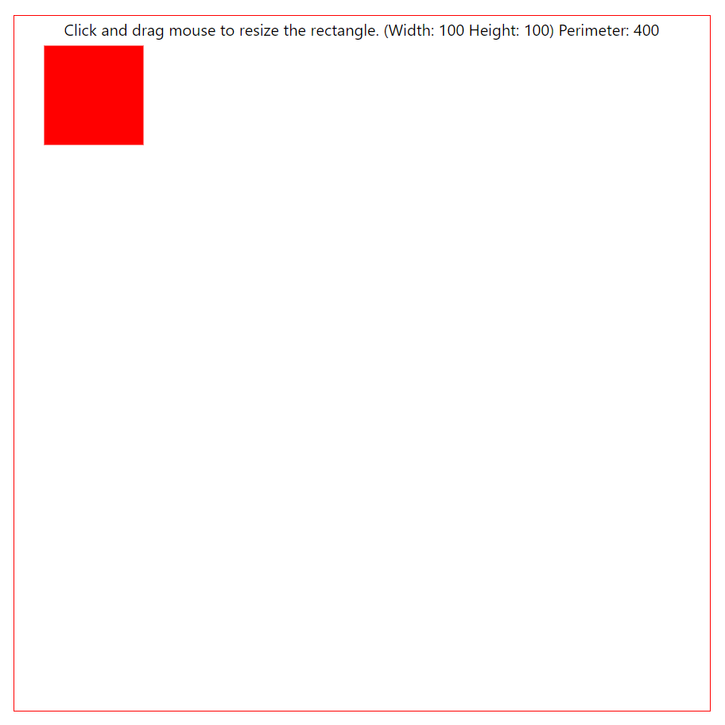
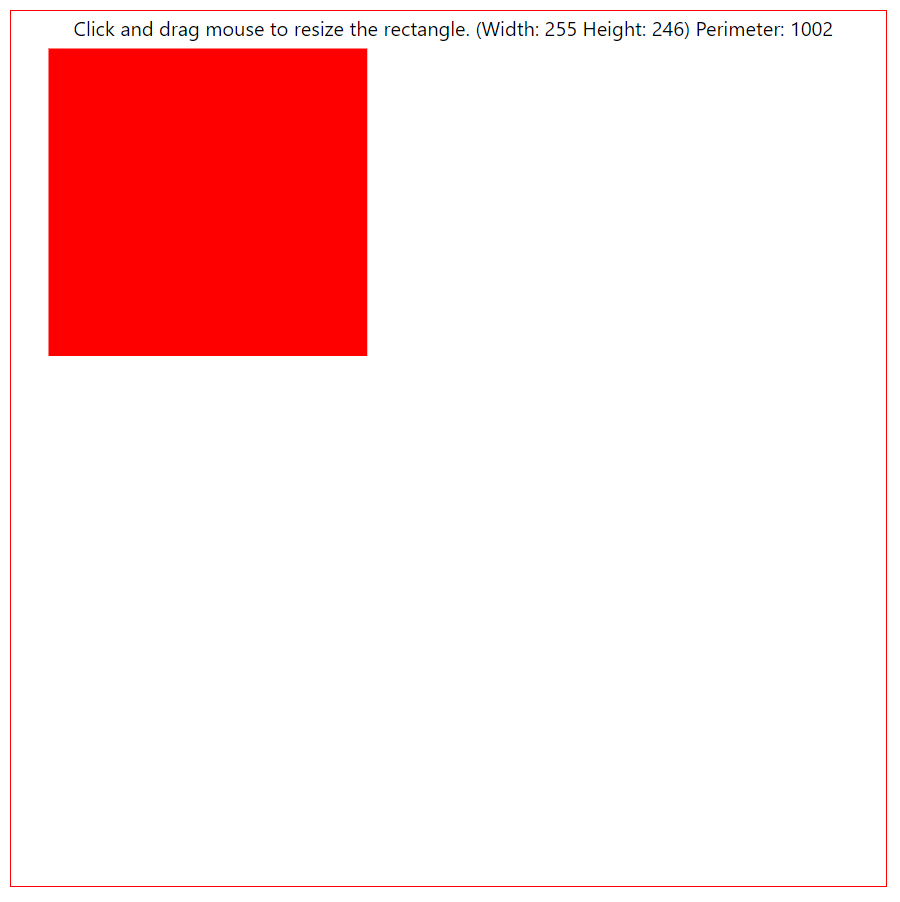
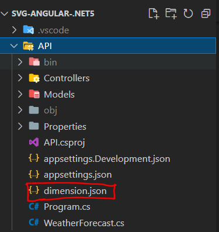

# Resiable SVG rectangle in Angular and .Net 6

## Task  
Create a webpage, for drawing rectangle SVG figure.
Near to the figure display the perimeter of the figure.

### Requirements
1. The initial dimensions of the SVG figure needs to be taken from JSON file.
2. The user should be able to resize the figure by mouse.
3. Near to the figure display the perimeter of the figure.
4. After resizing, system must update JSON file with new dimensions.

## How to run the project

1. Clone the project ``https://github.com/tanvirIqbal/svg-angular-.net6.git``
2. Open the project in VS Code
3. Open the VS Code terminal and run the command ``dotnet restore``
4. Go to API folder by ``cd API`` and run the command ``dotnet watch run``
5. Open another terminal and go to client folder by ``cd client`` and run the command ``ng serve -o``. It will open the application in the browser.

## Screenshots

When first run the application.

After resize the rectangle

JSON File location

